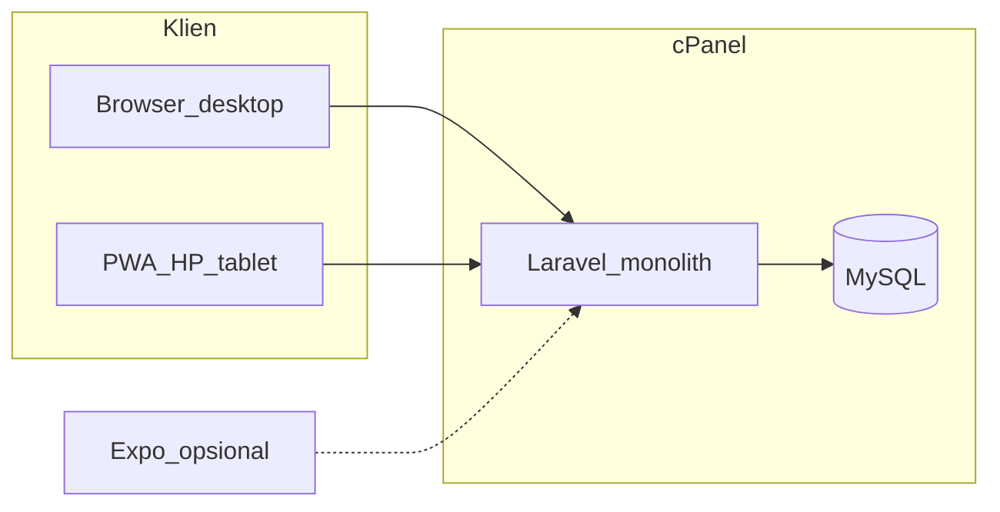

# Blueprint Aplikasi ERP Siap Pakai (cPanel, Tanpa VPS)

**Versi:** 2.0 (PWA-first + UI Laravel wajib)  
**Diperbarui:** strategi produksi tanpa VPS, prioritas **aplikasi web terpasang (PWA) + offline terbatas** sebelum aplikasi mobile native.

Dokumen ini merangkum **seluruh** cakupan aplikasi `erp_cnvs` (Next) dan rencana produk **siap pakai menyeluruh** di **cPanel (Laravel 11 + MySQL)** dengan:

1. **UI web Laravel lengkap** (semua modul ERP — bukan hanya API)  
2. **PWA** — bisa diunduh / “Add to Home Screen”, dukungan **offline** untuk operasional kasir  
3. **Mobile native (Expo)** — **opsional fase belakang**, hanya jika PWA tidak cukup  

**Konteks:** Next.js di shared cPanel rapuh (RAM, NPROC, Passenger, `.next`). Produksi tanpa VPS = **satu aplikasi Laravel (PHP)** di cPanel yang sama.

**Legacy:** folder `erp_cnvs` (Next) = referensi bisnis, UI, dan `lib/actions/*` — tidak dipakai di production.

### Status implementasi kode (`erp-platform/backend`)

| Fase | Status | Catatan |
|------|--------|---------|
| 0 Scaffold | ✅ | Laravel 12 + Breeze Inertia React |
| 1 Auth + shell | ✅ | Login, `ErpLayout`, nav role, outlet session, dashboard stats |
| 2 Migrasi parity | ✅ | Tabel inti ERP + `ErpSeeder` owner |
| 3 Modul bisnis | ✅ | Kasir (POS), Shift, Transaksi, Struk — beta operasional web |
| 4 PWA | 🟡 | manifest + SW dasar; sync offline belum |
| 5 Expenses/Reports | ✅ | Pengeluaran, Laporan bulanan/harian, Owner Dashboard |
| 6 Users/Logs | ✅ | CRUD user, mitra scopes, activity log |
| 7 Suppliers | ✅ | CRUD supplier, nav terintegrasi |
| 8 QA/Deploy | ⬜ | Belum |

Repo: **satu git**, path terpisah — `.gitignore` mengabaikan `erp-platform/backend/vendor`, `node_modules`, `public/build`.

---

## 1. Keputusan arsitektur (final)

| Lapisan | Teknologi | Hosting | Status blueprint |
|---------|-----------|---------|------------------|
| Database | MySQL (skema parity Prisma) | cPanel MySQL | Spesifikasi ✓ |
| **Aplikasi utama** | **Laravel 11 monolith** | cPanel `public/` | Wajib dibangun |
| **UI web** | **Inertia.js + React + Tailwind** | Sama (server-render + SPA) | **Termasuk — bukan opsional** |
| **Aplikasi terpasang** | **PWA** (manifest + service worker) | Browser HP/tablet | **Prioritas sebelum Expo** |
| API JSON | Route `web` + `api/v1` (Sanctum) | Sama | Untuk sync PWA & integrasi masa depan |
| File upload | `storage/app/public` | cPanel disk | ✓ |
| DSS Supplier (AHP-SAW) | `App\Services\Dss\*` (port `lib/dss/*`) | Laravel | Fase akhir |
| Mobile native | Expo (React Native) | EAS / sideload | **Fase opsional (9+)** |

### 1.1 Prinsip efisiensi

- **Satu codebase Laravel** untuk admin + kasir + laporan (tidak pisah “API dulu, UI kemudian”).  
- **Satu deploy** di cPanel (PHP), tanpa Node/Passenger/`.next`.  
- **PWA** menggantikan kebutuhan APK di fase awal (kasir di HP).  
- **Expo** hanya jika butuh fitur perangkat (Bluetooth printer, push native, dll.).



---

## 2. UI Laravel — apa yang “termasuk”

Blueprint v2 **mewajibkan tampilan UI**, bukan hanya endpoint.

| Aspek | Deliverable |
|-------|-------------|
| Layout | Sidebar, outlet selector, role-based nav (parity `dashboard-shell`) |
| Tema | Tailwind 4, dark mode (opsional), mobile-first breakpoint kasir |
| Halaman | Semua 14 area modul + login (lihat §2 inventaris) |
| Komponen | Tabel, dialog, form, chart (Chart.js / Recharts via React) |
| UX kasir | Grid produk, keranjang, pembayaran — touch-friendly |
| Deploy UI | Asset di-build `npm run build` → `public/build` (Vite), di-upload ke cPanel |

**Stack UI tetap:** **Inertia + React** (mirip pola komponen Next). Blade-only hanya untuk fallback/error page.

**Bukan termasuk di dokumen ini:** mockup Figma terpisah — UI mengikuti referensi `erp_cnvs/components/*`.

---

## 3. PWA — unduh & offline (prioritas sebelum Expo)

### 3.1 Yang dimaksud “bisa diunduh”

| Platform | Cara |
|----------|------|
| Android Chrome | Menu → **Install app** / Tambahkan ke layar utama |
| iOS Safari | **Add to Home Screen** |
| Desktop | Install icon di address bar (Chrome/Edge) |

Persyaratan: **HTTPS**, `manifest.webmanifest`, **service worker**, ikon 192/512.

### 3.2 Offline — realistis (bukan ERP penuh offline)

| Mode | Perilaku |
|------|----------|
| **Online** | Sumber kebenaran: server Laravel + MySQL |
| **Offline terbatas** | Cache shell UI + **katalog terakhir** + **draft keranjang** + **antrian transaksi** |
| **Sync** | Saat online: `POST /api/v1/sync/sales` (batch) + refresh katalog |

**Tidak offline:** login pertama, laporan real-time owner, stok akurat multi-kasir tanpa sync.

### 3.3 Implementasi teknis PWA

| File / modul | Fungsi |
|--------------|--------|
| `public/manifest.webmanifest` | nama, icons, `display: standalone`, `start_url` |
| `public/sw.js` atau Vite PWA plugin | precache assets, runtime cache |
| `resources/js/offline/db.ts` | IndexedDB: `catalog`, `cart_draft`, `pending_sales` |
| `resources/js/offline/sync.ts` | flush antrian saat `navigator.onLine` |
| Middleware `EnsureOnline` | Halaman owner/users wajib online |
| Banner UI | “Anda offline — transaksi akan dikirim saat online” |

### 3.4 Halaman yang harus PWA-ready (fase PWA)

| Prioritas | Halaman |
|-----------|---------|
| P0 | Login, pilih outlet, **Kasir**, daftar struk |
| P1 | Stok (lihat + restock), shift buka/tutup, waste |
| P2 | Dashboard ringkas, pengeluaran |
| P3 | Produk CRUD, users, owner, DSS (biasanya online saja) |

---

## 4. Inventaris fitur — parity 100% dengan ERP Next

Semua modul wajib di rilis “siap pakai menyeluruh”.

Kolom **UI web** = halaman Inertia; **PWA** = harus berfungsi di mode install/offline sesuai §3.

### 4.1 Autentikasi & sesi

| Fitur | Next | Laravel UI | PWA |
|-------|------|------------|-----|
| Login email + password | `loginAction` | `/login` Inertia | ✓ (online) |
| Logout | cookie JWT | session + Sanctum revoke | ✓ |
| Sesi web | cookie | `web` guard | session persist |
| Activity log | DB | sama | — |

### 4.2 Peran & izin

| Role | Akses default |
|------|----------------|
| **OWNER** | Semua + semua outlet |
| **STAFF** | dashboard, cashier, products, stock, expenses, waste, reports, receipts |
| **MITRA** | dashboard, stock (scoped), reports (scoped) |

| Fitur nav | OWNER | STAFF | MITRA |
|-----------|-------|-------|-------|
| dashboard | ✓ | ✓ | ✓ |
| cashier | ✓ | ✓ | — |
| products | ✓ | ✓ | — |
| stock | ✓ | ✓ | ✓ scoped |
| expenses | ✓ | ✓ | — |
| waste | ✓ | ✓ | — |
| reports | ✓ | ✓ | ✓ scoped |
| receipts | ✓ | ✓ | — |
| owner | ✓ | — | — |
| users | ✓ | — | — |
| outlets | ✓ | — | — |
| suppliers / DSS | ✓ | — | — |

`feature_overrides` (STAFF), `mitra_*_scopes` (MITRA) — port `lib/permissions.ts`.

### 4.3 Multi-outlet

| Fitur | Laravel |
|-------|---------|
| Daftar outlet user | `user_outlets` |
| Outlet aktif | session `outlet_id` + middleware |
| CRUD outlet (owner) | Inertia + controller |
| Salin menu | `copyOutletMenu` service |

### 4.4–4.16 Modul fungsional

*(Parity sama dengan v1 blueprint — ringkas)*

| Modul | Route web (contoh) | PWA offline |
|-------|-------------------|-------------|
| Dashboard `/` | ✓ UI + chart | cache summary (P2) |
| Kasir `/cashier` | ✓ | **katalog + cart + queue** (P0) |
| Produk `/products` | ✓ CRUD | online |
| Stok `/stock` | ✓ | lihat cache (P1), restock online |
| Waste `/waste` | ✓ | online (P1) |
| Expenses `/expenses` | ✓ | online |
| Shift `/reports/shifts` | ✓ | buka/tutup online (P1) |
| Laporan `/reports` | ✓ | online |
| Struk `/receipts` | ✓ | list cache (P1) |
| Owner `/owner` | ✓ | online |
| Users `/users`, logs | ✓ | online |
| Profil `/profile` | ✓ | online |
| Supplier DSS `/suppliers` | ✓ tab AHP/SAW | online |

Logika bisnis: port `lib/actions/*` → `app/Services/*` (§16).

---

## 5. Model data (MySQL)

Migrasi Laravel; nama tabel = `@@map` Prisma:

```
users, user_outlets, user_activity_logs, outlets, display_groups,
suppliers, (+ dss_* jika aktif),
stock_items, restock_logs, products, conversions,
transactions, transaction_items, petty_cash, waste_logs, shift_records,
mitra_product_scopes, mitra_stock_scopes
```

- Uang: `DECIMAL(18,4)` — `brick/math` / BCMath, jangan float.  
- ID: pertahankan string `cuid` saat import data Next.

---

## 6. API (`/api/v1`) — untuk PWA sync & masa depan

Header: `Authorization: Bearer {token}`, `X-Outlet-Id: {id}`.

Endpoint lengkap (parity v1): auth, outlets, dashboard, products, stock, waste, sales, shifts, expenses, reports, users, display-groups, suppliers/DSS.

**Tambahan PWA:**

```
GET    /sync/catalog              # snapshot produk + stok + harga (ETag)
POST   /sync/sales                # batch pending sales dari IndexedDB
GET    /sync/status               # health + server time
```

Web Inertia boleh memakai **session** tanpa token; PWA memakai **Sanctum token** setelah login.

---

## 7. Aplikasi mobile native (Expo) — opsional

**Dijadwalkan setelah PWA stabil** (bukan blocker rilis 1.0).

| Kapan perlu Expo | Kapan PWA cukup |
|------------------|-----------------|
| Bluetooth printer struk | Share/PDF struk dari browser |
| Push notification native | Web push (opsional, fase 2) |
| App store wajib | Install PWA internal cukup |

Struktur layar Expo = sama §5 v1 (14 layar) — referensi, bukan prioritas build.

---

## 8. Deploy Laravel + PWA di cPanel

### 8.1 Struktur

```
~/apps/erp/                 # Laravel root
  public/                   # document root subdomain
    manifest.webmanifest
    sw.js
    build/                  # Vite assets
  .env
```

### 8.2 `.env` (DB tanpa URL-encoding masalah)

```env
APP_URL=https://erp.domain.tld
DB_CONNECTION=mysql
DB_HOST=localhost
DB_DATABASE=...
DB_USERNAME=...
DB_PASSWORD=...              # plain — bukan DATABASE_URL satu string

SESSION_DRIVER=file
SANCTUM_STATEFUL_DOMAINS=erp.domain.tld
```

### 8.3 Langkah deploy

1. Build lokal: `composer install --no-dev`, `npm ci && npm run build`  
2. Upload ke cPanel (exclude `node_modules` dev — vendor + `public/build`)  
3. `php artisan migrate --force`, `db:seed`, `storage:link`  
4. Document root → `public/`  
5. HTTPS wajib untuk PWA  
6. Import data Next: §9  

**Tidak perlu:** Passenger Node, upload `.next`, `prisma generate` di server.

Dokumen operasional: lihat juga `DEPLOY-CPANEL.md` (Next — arsip) dan **`DEPLOY-LARAVEL-CPANEL.md`** (akan dibuat saat repo `erp-platform` ada).

---

## 9. Migrasi data dari ERP Next

1. Backup MySQL cPanel  
2. Migrasi Laravel ke tabel sama → data tetap  
3. Password: kolom `password_hash` bcrypt kompatibel  
4. Gambar: `public/uploads` → `storage/app/public/uploads`  

---

## 10. Urutan implementasi (revisi v2 — efisien)

Estimasi **1 developer**; part-time ×2–3 durasi.

| Fase | Minggu | Deliverable |
|------|--------|-------------|
| **0** | 1 | Repo `erp-platform/backend`, migrasi, seed owner, auth web + Sanctum, layout shell |
| **1** | 2 | UI: login, outlet picker, dashboard dasar, middleware izin |
| **2** | 2–3 | UI+service: produk, stok, display groups, upload gambar |
| **3** | 2 | UI+service: shift, kasir, transaksi, struk — **beta operasional web** |
| **4** | 1–2 | **PWA:** manifest, SW, IndexedDB katalog, antrian penjualan, sync API |
| **5** | 2 | UI: waste, expenses, reports, owner |
| **6** | 1 | UI: users, logs, mitra scopes |
| **7** | 1 | Suppliers + DSS + chart |
| **8** | 1 | QA, import data, `DEPLOY-LARAVEL-CPANEL.md`, panduan “Install PWA” |
| **9+** | opsional | Expo mobile |

**Total:** ~11–13 minggu part-time untuk **web + PWA menyeluruh**. Expo tidak menghitung.

### 10.1 Urutan coding (repo)

```
erp-platform/
  backend/                 # Laravel 11 + Inertia React
    app/Services/          # port lib/actions
    resources/js/Pages/    # UI tiap modul
    resources/js/offline/  # PWA sync
    public/manifest.webmanifest
  docs/
    BLUEPRINT-APLIKASI-LENGKAP.md
  legacy/                  # copy/symlink erp_cnvs Next
```

**Tidak ada folder `mobile/`** sampai Fase 9+ disetujui.

---

## 11. Kriteria “siap pakai menyeluruh” (acceptance v2)

### Web UI
- [ ] Semua modul §4 punya halaman Inertia yang bisa dipakai operator
- [ ] Nav & izin OWNER/STAFF/MITRA sama Next
- [ ] Kasir touch-friendly di viewport HP (browser)

### PWA
- [ ] Install ke layar utama (Android + iOS) berhasil
- [ ] Kasir: katalog cache + keranjang offline + sync penjualan saat online
- [ ] Banner/status offline jelas

### Hosting
- [ ] Jalan di cPanel PHP tanpa Node
- [ ] Tidak ada Index of / 503 karena Passenger

### Data & bisnis
- [ ] Parity `processSale`, `closeShift`, mitra scope, decimal uang
- [ ] Import data Next (jika ada) OK

### Opsional (bukan blocker 1.0)
- [ ] Expo APK
- [ ] DSS supplier (jika bisnis wajib — masuk Fase 7)

---

## 12. Langkah segera (minggu ini)

1. ~~Buat `erp-platform/backend`~~ ✅  
2. ~~Inertia + React + Breeze~~ ✅  
3. ~~Migrasi parity Prisma~~ ✅  
4. ~~Fase 0–1 (auth, layout, dashboard)~~ ✅ — lanjut **port modul** dari `lib/actions/*`  
5. **Freeze** deploy Next di cPanel  
6. Deploy Laravel: [erp-platform/backend/DEPLOY-LARAVEL-CPANEL.md](erp-platform/backend/DEPLOY-LARAVEL-CPANEL.md)  

---

## 13. Realitas singkat

| Harapan | Realitas v2 |
|---------|-------------|
| Siap pakai tanpa VPS | **Ya** — Laravel + PWA di cPanel |
| UI Laravel termasuk? | **Ya — wajib** (Inertia React) |
| Unduh + offline sebelum mobile? | **Ya — PWA Fase 4** |
| Expo wajib? | **Tidak** — opsional |
| Selesai dalam beberapa hari | **Tidak** — ~3 bulan part-time |

---

## 14. Lampiran — mapping Next → Laravel

| Next | Laravel |
|------|---------|
| `lib/actions/*.ts` | `app/Http/Controllers/*` + `app/Services/*` |
| `lib/permissions.ts` | `app/Policies/*`, `CheckNavFeature` middleware |
| `lib/dss/*.ts` | `app/Services/Dss/*` |
| `lib/money.ts` | `App\Support\Money` |
| `middleware.ts` | `auth`, `EnsureOutlet`, `EnsureOnline` (PWA) |
| `components/*` | `resources/js/Pages/*`, `resources/js/Components/*` |
| `prisma/schema.prisma` | `database/migrations/*` |
| `app/(dashboard)/**` | `routes/web.php` + Inertia pages |

---

## 15. Changelog blueprint

| Versi | Perubahan |
|-------|-----------|
| 1.0 | API-first + Expo operasional utama |
| **2.0** | **UI Laravel wajib**, **PWA before Expo**, monolith, sync API, fase diurut ulang |

---

*Spesifikasi produk lengkap. Implementasi kode di `erp-platform/`; legacy `erp_cnvs` (Next) sebagai acuan UI dan perilaku.*
